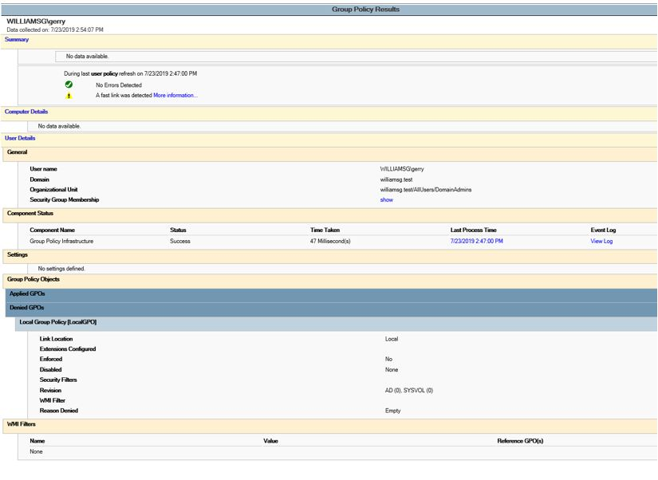

# Level 1 Server CIS Benchmarks:

| OS Version | Percent Passed |
| --- | --- |  
| 2012 Member Server | 97.43 |
| 2012 Domain Controller | 97.34 |
| 2016 Member Server | 98.27 |
| 2016 Domain Controller | 97.49 |
| Centos 7.6.1810 | 95.57 |
| RHEL 7.6 Maipo| 96.84|

#### Pics:

2012 Member Server:  

2012 Domain Controller:  

2016 Member Server:  

2016 Domain Controller:  

#### Group Policy on the primary Domain Controller (2016dc):

2016 Domain Controller:  

#### Results from `gpresult /scope computer /h c:\scripts\computer.html`:  

#### Results from `gpresult /scope user /h c:\scripts\user.html`:  

Centos 7:  

RHEL 7:  

